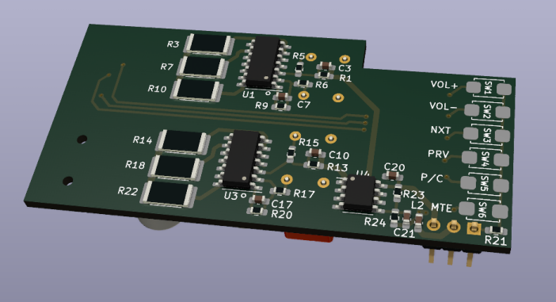

# APTX_HEADSET

Kicad [schematic](aptx_headset.pdf) and PCB layout for an APTX headset.
* FT-3188 Qualcomm CSR8645 module 
* OPA1664 opamps for balanced to single-ended conversion and headphone driver circuit.
* Two layers, 65 mm x 32 mm.

## Top

## Bottom

